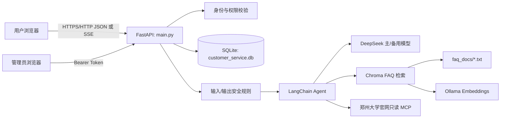
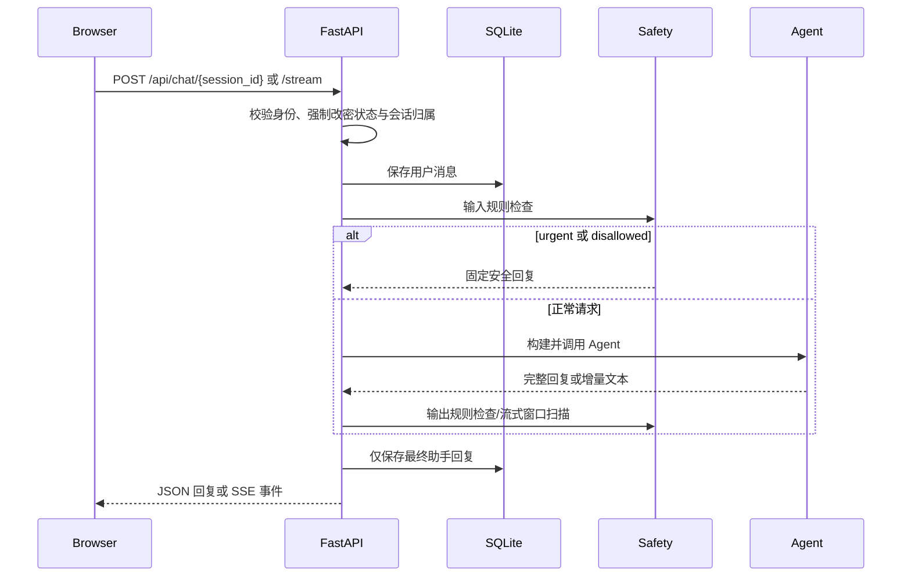
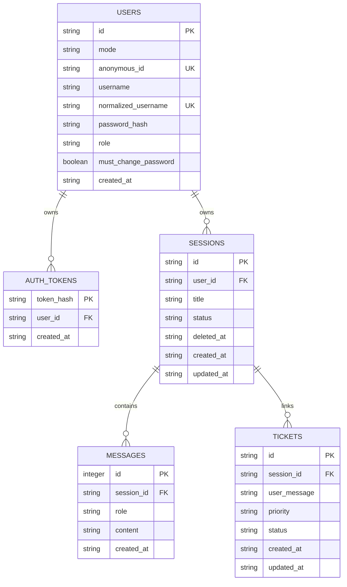

# 有话说开发文档

> 文档状态：当前实现说明
> 事实基线：`main.py`、`database.py`、`models.py`、`config.py`、`agent_factory.py`、`rag.py`、`safety.py`、`requirements.txt` 和 `tests/`。
> 最后核对：2026-08-17

## 1. 项目概览

“有话说”是一个面向大学生的网页情绪陪伴与问题解决服务。FastAPI 同时提供用户聊天页、管理员页面和 JSON/SSE API；后端持久化用户、会话与消息，并在调用大模型前后执行本地安全检查。

### 已确认的功能

- 两种聊天模式：`companion`（情绪陪伴）与 `problem_solving`（问题解决）。
- 匿名身份与用户名密码账号；匿名会话可在注册时迁移到新账号。
- 用户会话创建、查看、软删除与历史消息读取。
- 同步聊天接口与 SSE 流式聊天接口。
- 账号角色：`user`、`admin`、`super_admin`；管理员页面为 `/admin`。
- FAQ 文档的 Chroma 向量检索，以及按需读取郑州大学官网公开资料的只读 MCP 工具。
- 本地规则驱动的危险输入、危险输出和不安全诊断语句检查。

### 非目标与边界

- 不提供医疗诊断、治疗承诺、法律定论、投资建议或危险/违法操作指导。
- 高风险输入返回固定安全提示，不自动联系学校、辅导员或其他真人。
- 当前模型工具中的天气和订单查询均为模拟数据，不能视为真实外部服务集成。
- 当前实现使用 SQLite 和本地 Chroma 目录；生产 PostgreSQL、CDN、托管向量库等仅出现在设计资料中，尚未在代码中实现。

## 2. 运行架构



### 请求主流程



## 3. 目录与模块

| 路径 | 职责 |
| --- | --- |
| `main.py` | FastAPI 应用、生命周期初始化、认证授权、HTTP/SSE API。 |
| `models.py` | Pydantic 请求和响应模型。 |
| `database.py` | 异步 SQLite 建表、迁移与数据访问。 |
| `config.py` | 路径、模型名、提示词、安全与 RAG 参数。 |
| `agent_factory.py` | 按请求组装 LangChain Agent 与中间件链。 |
| `safety.py` | 本地输入分类、输出检查和安全兜底文案。 |
| `middleware.py` | Agent 输入拦截、PII 中间件接入、输出检查与工具审计。 |
| `circuit_breaker.py` | 进程内共享的模型调用熔断中间件。 |
| `rag.py` | FAQ 加载、Ollama Embedding、Chroma 向量库与检索工具。 |
| `zzu_campus_mcp.py` | 郑州大学官网只读 MCP Server、URL 校验与 HTML 正文提取。 |
| `tools.py` | 模拟天气、订单查询，以及未接入 Agent 的旧工单转接工具。 |
| `static/index.html` | 用户聊天页面。 |
| `static/admin.html` | 管理员页面。 |
| `faq_docs/` | 以 `Q:`/`A:` 组织的 FAQ 文本来源。 |
| `skills/campus-emotional-support/SKILL.md` | Agent 运行时读取的情绪陪伴补充约束。 |
| `tests/` | `unittest` 测试。 |
| `docs/superpowers/` | 历史设计与实施计划，非当前实现的唯一依据。 |

## 4. 身份、权限与会话

### 身份方式

| 方式 | 认证信息 | 行为 |
| --- | --- | --- |
| 匿名用户 | `X-Anonymous-Id` 请求头 | 缺失时 `POST /api/auth/anonymous` 会生成 UUID；会话按匿名身份隔离。 |
| 账号用户 | `Authorization: Bearer <token>` | 令牌仅以 SHA-256 哈希写入数据库；每个用户仅保留一个有效令牌。 |

注册接口要求已有匿名身份，并将该匿名用户的会话迁移到新账号。用户名按 `casefold()` 规范化后唯一。密码以 PBKDF2-HMAC-SHA256（210000 次迭代、随机盐）保存。

### 角色矩阵

| 能力 | `user` | `admin` | `super_admin` |
| --- | --- | --- | --- |
| 使用自己的聊天与会话 | 是 | 是 | 是 |
| 搜索账号、重置普通用户密码 | 否 | 是 | 是 |
| 调整 `user`/`admin` 角色 | 否 | 否 | 是 |
| 查看账号用户会话及消息 | 否 | 否 | 是 |
| 永久删除已软删除的会话 | 否 | 否 | 是 |

用户删除会话仅设置 `deleted_at`，该会话对用户不可见；只有总管能永久删除已经软删除的会话及其消息、关联工单。数据库初始化会将规范化用户名为“十里”的现有账号设为唯一 `super_admin`；不会创建默认账号。

管理员重置普通用户密码后，会使旧令牌失效并设置强制改密状态。强制改密账号只能修改密码或退出，不能使用会话和聊天接口。

## 5. API 概览

除显式说明外，请求体为 JSON。需要身份的接口接受账号 Bearer 令牌或匿名 ID；管理员接口必须使用账号 Bearer 令牌。

### 页面与认证

| 方法 | 路径 | 说明 |
| --- | --- | --- |
| `GET` | `/` | 返回用户聊天页面。 |
| `GET` | `/admin` | 返回管理页面；页面数据仍由接口权限控制。 |
| `POST` | `/api/auth/anonymous` | 创建或恢复匿名身份。 |
| `POST` | `/api/auth/register` | 注册账号并迁移当前匿名会话。 |
| `POST` | `/api/auth/login` | 账号登录并签发令牌。 |
| `POST` | `/api/auth/logout` | 删除当前账号令牌。 |
| `POST` | `/api/auth/change-password` | 校验原密码、更新密码并重新签发令牌。 |

`/api/auth/register` 与 `/api/auth/login` 请求体：

```json
{
  "username": "student",
  "password": "example-password"
}
```

用户名长度为 1 至 100；密码长度为 1 至 10。示例仅表示结构，不能在仓库、日志或文档中使用真实密码。

### 会话与聊天

| 方法 | 路径 | 说明 |
| --- | --- | --- |
| `POST` | `/api/sessions` | 创建会话，初始标题为“新会话”。 |
| `GET` | `/api/sessions` | 列出当前用户未软删除的会话。 |
| `GET` | `/api/sessions/{session_id}` | 读取当前用户的会话与消息。 |
| `DELETE` | `/api/sessions/{session_id}` | 软删除当前用户的会话。 |
| `POST` | `/api/chat/{session_id}` | 非流式聊天，返回完整助手回复。 |
| `POST` | `/api/chat/{session_id}/stream` | 流式聊天，响应类型为 `text/event-stream`。 |

聊天请求体：

```json
{
  "content": "我最近压力很大",
  "mode": "companion"
}
```

`content` 长度为 1 至 5000；`mode` 仅可为 `companion` 或 `problem_solving`。新会话在收到首条消息后，以该消息前 20 个字符更新标题。

SSE 接口按顺序产生以下事件：

| 事件 | 数据 |
| --- | --- |
| `start` | `session_id`、`mode`。 |
| `tool` | 查询过程状态：`call_id`、`tool`、`status`、`label`；不包含工具参数或返回结果正文。 |
| `delta` | 文本增量，字段为 `text`。 |
| `done` | `session_id`。 |
| `error` | `message`、`reason_code`；发生错误时不会写入未完成的助手草稿。 |

### 管理与工单

| 方法 | 路径 | 最低角色 | 说明 |
| --- | --- | --- | --- |
| `GET` | `/api/admin/users?query=` | `admin` | 搜索账号用户，返回 ID、用户名、角色与强制改密状态。 |
| `POST` | `/api/admin/users/{user_id}/reset-password` | `admin` | 只能重置 `user` 角色账号。 |
| `PATCH` | `/api/admin/users/{user_id}/role` | `super_admin` | 目标角色仅可为 `user` 或 `admin`。 |
| `GET` | `/api/admin/users/{user_id}/sessions?limit=50&offset=0` | `super_admin` | 查看指定账号的会话摘要。 |
| `GET` | `/api/admin/sessions/{session_id}/messages` | `super_admin` | 只读查看会话消息。 |
| `DELETE` | `/api/admin/sessions/{session_id}` | `super_admin` | 永久删除已软删除会话。 |
| `GET` | `/api/tickets` | 当前用户 | 返回当前用户会话关联的工单。 |
| `POST` | `/api/tickets` | 当前用户 | 为当前用户拥有的会话创建工单。 |

角色更新请求体：

```json
{
  "role": "admin"
}
```

工单创建请求体：

```json
{
  "session_id": "<session-id>",
  "user_message": "<message>",
  "priority": "medium"
}
```

## 6. 数据模型

当前数据库为 `customer_service.db`。应用启动时执行 `CREATE TABLE IF NOT EXISTS` 和有限的列迁移，不使用独立迁移工具。



`sessions(user_id, updated_at DESC)` 有索引；`users(role)` 通过部分唯一索引保证最多一个 `super_admin`。

## 7. Agent、RAG 与安全机制

### Agent 组装

每个聊天请求都会新建 Agent，并使用以下中间件链：

1. 进程内熔断器：连续失败 3 次后打开，冷却 30 秒后半开试探。
2. 输入违禁词拦截。
3. `PIIMiddleware`（当前配置类型为 `email`）。
4. 使用备用模型进行长历史摘要，阈值为 3000 tokens。
5. 模型重试，最多 3 次。
6. 主模型不可用时的备用模型回退。
7. Agent 输出检查与工具调用审计。

两个聊天模式均可使用模拟天气、模拟订单、按关键词启用的 FAQ 检索和启动时加载的郑州大学官网只读 MCP 工具；模式差异仅体现在回答目标和提示词上。

### FAQ 检索

- 仅加载 `faq_docs/` 下的 `.txt` 文件，并以 `Q:` 分段。
- 运行时通过 `OllamaEmbeddings` 创建嵌入，Chroma 索引持久化至 `chroma_store/`。
- 仅当任一模式的消息命中预设校园关键词时，才将 `search_faq` 工具提供给 Agent。
- 默认返回 3 条，Chroma 相似度阈值为 0.5；无结果时工具要求 Agent 如实说明没有答案。

### 郑州大学官网 MCP

- 提供 `search_zzu_official_site`、`read_zzu_official_page` 和 `list_zzu_official_sources` 三项只读工具。
- 两个聊天模式均可调用；涉及校内事实时，回答仅依据工具返回内容并附官方链接。
- 仅允许访问 `zzu.edu.cn` 及其子域名的公开 HTML 页面；拒绝 IP 地址、外部域名、非默认端口和跨域重定向。
- 页面读取按需使用 GET；站内搜索仅向郑州大学公开搜索入口发送关键词 POST 请求，不执行登录、提交、写入或批量抓取。
- 返回内容包含官方来源 URL 和抓取时间。官网不可用、返回非 HTML 或页面过大时，工具返回安全错误而不暴露内部异常。

### 安全路径

- 输入规则将明确的自伤/伤人/暴力信号标为 `urgent`，将危险或违法请求标为 `disallowed`，并直接返回固定安全文案。
- 非流式回答会执行完整输出检查；涉及危险指导时阻断，涉及诊断或不安全建议时尝试重写一次。
- 流式回答对最近 1024 个字符执行滚动扫描；触发危险输出时发送 `error`，不保存助手草稿。
- 普通用户消息会在安全检查前写入数据库；只有完整、通过检查的助手回复才会被保存。

## 8. 本地开发

### 前置条件

- 已安装可运行项目依赖的 Python 环境。
- 已启动 Ollama，并准备好与 `OLLAMA_EMBEDDING_MODEL` 匹配的嵌入模型。
- 已为 DeepSeek 模型提供运行所需凭据。该凭据不应写入代码、文档或日志。

### 环境变量

下表仅记录当前 `.env` 中出现的变量名，绝不记录值。

| 变量 | 当前代码关系 |
| --- | --- |
| `OLLAMA_EMBEDDING_MODEL` | `rag.py` 直接传给 `OllamaEmbeddings(model=...)`。 |
| `OLLAMA_BASE_URL` | `rag.py` 直接传给 `OllamaEmbeddings(base_url=...)`。 |
| `DEEPSEEK_API_KEY` | `.env` 中存在；模型标识为 `deepseek:*`，凭据由 LangChain 的模型提供方在运行时解析。 |
| `OPENROUTER_API_KEY` | `.env` 中存在，但当前 Python 源码未引用，不能作为当前运行前提。 |

不要提交 `.env`、数据库、向量库或任何凭据。`.gitignore` 已忽略这些本地文件。

### 安装与启动

在项目根目录执行：

```powershell
python -m pip install -r requirements.txt
python -m uvicorn main:app --host 127.0.0.1 --port 8000
```

浏览器访问 `http://127.0.0.1:8000`，管理页面为 `http://127.0.0.1:8000/admin`。

项目还提供 `start.bat`。它会检查本地 11434 端口、尝试启动固定路径的 Ollama、检查 `qwen3-embedding:0.6b`，再通过 `..\\venv\\Scripts\\python.exe` 启动 Uvicorn。该脚本依赖特定本地安装和虚拟环境位置；直接使用上述命令更适合通用开发环境。运行前应确保脚本检查的嵌入模型与 `.env` 的 `OLLAMA_EMBEDDING_MODEL` 一致。

## 9. 测试与检查

测试使用标准库 `unittest`，覆盖安全规则、流式事件格式、用户会话隔离、账号和管理员权限、模型配置、FAQ 检索与静态页面契约。

运行全部测试：

```powershell
python -m unittest discover -s tests -p "test_*.py"
```

运行单个模块示例：

```powershell
python -m unittest tests.test_safety
```

测试中部分内容为源代码和静态页面契约检查；它们不能替代真实模型、Ollama、MCP 和浏览器环境的端到端验证。

## 10. 当前实现风险与待处理项

以下条目以当前代码为准，不视为已解决的能力。

| 项目 | 现状 | 影响 |
| --- | --- | --- |
| 本地持久化 | SQLite 与 Chroma 均依赖本地磁盘。 | 多实例部署、备份、恢复和高并发写入尚无实现。 |
| 官网 MCP | 资料按需从郑州大学官网读取。 | 依赖官网可用性和页面结构；无法获取可靠资料时必须如实说明。 |
| 工单遗留接口 | `main.py` 暴露工单 API，`tools.py` 仍有人工转接工具工厂，但 Agent 当前没有注册它；用户页测试也要求不调用工单接口。 | 工单功能边界与当前“仅提供真人帮助入口”的产品语义不一致，应在后续明确保留或移除。 |
| FAQ 描述 | 触发关键词为校园主题，但 `search_faq` 的工具描述仍包含账号、退款、物流、订单等旧客服文本。 | 检索提示词与当前业务领域不一致，可能影响回答质量。 |
| 模型熔断文案 | `config.py` 和 `circuit_breaker.py` 的默认/实际熔断提示文案不同。 | 出现熔断时实际使用 `circuit_breaker.py` 中的文案。 |
| 流式安全 | 已有窗口扫描，但已发送的增量无法撤回。 | 高风险输入仍应在进入流式路径前被更严格识别。 |
| 生产部署 | HTTPS、PostgreSQL、备份恢复、日志脱敏、监控告警仅在历史设计文档中提出。 | 上线前需要形成可执行的部署与运维方案。 |

## 11. 相关资料

- `docs/superpowers/specs/`：功能、部署和安全设计稿。
- `docs/superpowers/plans/`：历史实施计划。
- `skills/campus-emotional-support/SKILL.md`：运行时情绪陪伴指导。

这些资料可用于理解背景；当其与本 README 或当前代码不一致时，以当前代码和测试为准。
