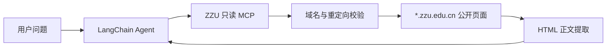

# 郑州大学只读校园资料 MCP 设计

日期：2026-08-18

## 目标

为“有话说”提供按需读取郑州大学公开官网资料的只读 MCP 工具。工具只能访问 `zzu.edu.cn` 及其子域名，不批量下载网站、不写入本地或远端数据，并向 Agent 返回可追溯的官方来源。

## 范围与非目标

本次实现三个工具：

- `search_zzu_official_site(query)`：调用郑州大学官网公开搜索入口，返回匹配页面的标题、URL 和摘要。
- `read_zzu_official_page(url)`：读取一个允许域名内的公开页面，提取标题和可读正文。
- `list_zzu_official_sources()`：返回推荐的官方入口及用途，供 Agent 在搜索不可用时选择。

不实现网页批量抓取、后台同步、网页提交、登录、验证码处理、任意互联网访问或自动联系校方人员。问题解决模式不获得任何 MCP 工具。

## 架构

新增 `zzu_campus_mcp.py` 作为 Python stdio MCP Server，复用现有 `mcp` 依赖。FastAPI 生命周期通过当前 Python 解释器启动该 Server，并使用 `MultiServerMCPClient` 获取工具；不再启动通用文件系统 MCP Server。

MCP Server 对页面读取只处理公开 GET 请求；官网搜索仅向公开搜索入口发送关键词 POST 请求，不提交表单以外的数据。每一个初始 URL 和重定向目标均需通过 URL 校验：协议只能为 HTTP 或 HTTPS，主机名必须等于 `zzu.edu.cn` 或以 `.zzu.edu.cn` 结尾，禁止用户信息、非默认端口和 IP 地址主机。请求配置固定超时和响应体上限，HTML 仅提取标题与正文文本，忽略脚本、样式和嵌入内容。

## 数据流与错误处理

对于校园信息问题，陪伴模式中的 Agent 可调用搜索工具获得官方链接，再调用读取工具获得正文。每个结果包含 `source_url` 和 `fetched_at`；Agent 提示词要求基于返回内容作答并说明来源，不确定时明确表示未检索到官方资料。

非法 URL、跨域重定向、超时、非 HTML 响应、过大响应和官网暂时不可访问均返回简洁错误文本，不抛出包含内部堆栈或网络细节的异常。工具不接受文件路径，也不提供任何写、删、移动或执行能力。

## 配置

`config.py` 增加官方域名后缀、请求超时、最大响应大小和官方入口列表。所有值为非敏感运行参数，不新增密钥、令牌或环境变量。

## 代码变更

- 新建 `zzu_campus_mcp.py`：URL 校验、HTTP 获取、HTML 提取和 MCP 工具定义。
- 修改 `config.py`：校园官网工具的固定运行参数。
- 修改 `main.py`：启动 Python MCP Server，删除通用文件系统 MCP Server 和可写工具 schema。
- 修改 `agent_factory.py`：补充 MCP 使用边界和来源回答约束。
- 新建 `tests/test_zzu_campus_mcp.py`：校验只读与网络边界。
- 修改 `tests/test_companion_backend.py`：校验启动配置不再使用文件系统 MCP。
- 修改 `README.md`：记录工具能力、运行前提和安全边界。

## 测试

单元测试使用伪造 HTTP 响应，不依赖郑州大学官网实时可用性。覆盖允许根域和子域、拒绝外部域/IP/非默认端口、拒绝跨域重定向、正文提取、搜索结果解析以及无写工具契约。回归运行全部 `unittest` 测试。

人工验证时启动服务后，使用校园资料问题触发陪伴模式，确认 Agent 返回郑大官方链接；使用问题解决模式确认没有 MCP 工具；使用非郑大 URL 确认工具拒绝访问。
